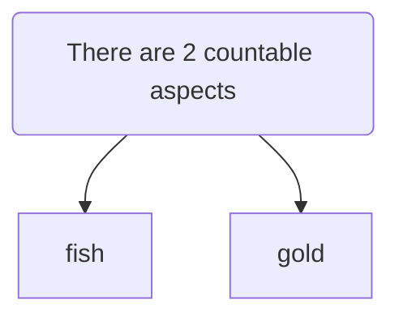

# Rare Fish Game
## Desc
this is a game where players collect rare uncles from mongolia, somalia, and other places

each is procedurally generated with different attributes that affect their gameplay, what type of fish they collect, how rare it is, and more

- have different types of fish that can be collected, each with different attributes that affect gameplay
- have different rarity levels for each fish, with rarer fish being more valuable
- have different locations where fish can be found, each with different types of fish

## Gameplay
- the default beginner game screen starts with one default mongolian uncle fishing in a pond, getting fish at a meager rate, and only getting very common fish.

- As the player progresses, they can unlock new uncles from different places with different abilities, and find rarer fish in more difficult to reach places.

- The game will procedurally generate fish, with rarer fish having certain attributes, will be worth more, and could even have special boosts provided with catching them.

- You click the fishing button to catch fish, the fish counter increments and a fish is generated physically, and its value is calculated and stored. You have the option to cash out at any point, or continue fishing for bigger bonuses.

- Later on in the game, you will have auto catching and auto harvesting.

- upgrades to alter exchange rate of fish to gold

## Generation

examples of rare fish attributes could be:

- uncommon coloration
- unusual pattern
- uncommon size
- unusual shape

examples of rare uncle attributes could be:

-uncommon ability to catch rare fish
-unusual fishing spots
-uncommon fishing gear

the random fish generation will simply be a concatenation of different fish "parts" into an instance of a fish prefab, and its value/rarity will be determined as a function of those parts.

img of uncle:

img of fish:

